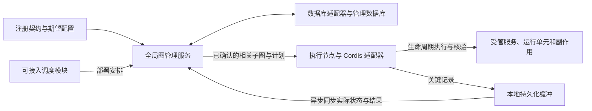

# Continuum：第一版设计基线

日期：2026-09-26

状态：已确认的设计共识，等待实现与实验验证。本文描述目标行为和边界，不代表仓库已经具备这些能力。

[项目概览](../README.md)介绍产品方向；[概念与可行性验证计划](concept-and-feasibility.md)说明如何取得验证证据。数据库选型、公开 API、具体规模指标和跨节点协调协议仍待确定。

## 1. 持续服务的目标

> 在声明的故障模型、资源耦合与服务策略下，系统能够限制局部扰动的影响，持续提供仍然合法的服务模式，并在条件稳定后完成可解释的局部恢复。

核心目标是影响遏制、部分有效性与局部恢复。完整服务、合法降级和局部不可用都需要可表达的条件。热替换、动态配置和在线演进是这一能力的应用场景。

保证取决于实际覆盖的管理入口、资源关系和执行条件。共享事件循环、进程或外部资源可能形成额外故障耦合；清理函数、业务补偿和状态迁移各有自己的完成条件。

## 2. 编程模型与托管边界

普通对象仍可由业务代码创建、持有和调用。Continuum 对受管运行单元的激活、撤销和恢复实施必要的控制反转，不要求所有对象统一通过依赖注入创建。

同一服务可以包含受管与非受管部分，需要分别说明：

| 边界 | 含义 |
|---|---|
| 功能边界 | 服务对业务提供哪些能力 |
| 管理边界 | 哪些运行单元、调用入口、任务、资源与副作用由 Continuum 协调 |
| 保证边界 | 哪些行为满足已登记契约，因而可以纳入持续服务承诺 |

参与保证的跨边界交互，需要相应的访问撤销、任务准入或资源归属协议。纯计算和普通值传递可以保持通常的编程方式。托管范围由实际接入能力决定。

核心采用协作式生命周期协议：提供方登记清理逻辑，运行时协调执行。永久挂起、死循环的识别与强制处置属于后续感知或隔离能力，另行定义保证。

## 3. Cordis 的角色与概念映射

Cordis 是首个执行适配目标，Continuum 保持独立的管理模型。实验可以使用一个 Cordis 宿主连接真实外部资源；正式产品的部署形态、生产服务集合与执行环境独立设计。

沿用以下概念区别：

| 对象 | 管理含义 |
|---|---|
| Service | 可被消费的服务能力；服务对象可以承载实际业务方法 |
| Fiber | 插件挂载形成的运行单元，承载生命周期、依赖与副作用归属 |
| 提供关系 | 关联服务能力、实现值与提供该能力的 Fiber；Cordis 中由 Impl 表达 |
| 消费绑定 | 记录消费者实际使用的提供关系及其作用范围 |
| 受管副作用 | 具有身份、所有者、清理规则和结果记录的资源或行为 |

Service 与 Fiber 不预设一对一对应。管理数据需要保留能力、提供关系、消费绑定、运行状态与副作用归属的区别。[Service 实现](https://github.com/cordiverse/cordis/blob/f8ea3cd50f1a5724e8e715995bcde131c9c12b2c/packages/core/src/service.ts)、[Impl 与绑定实现](https://github.com/cordiverse/cordis/blob/f8ea3cd50f1a5724e8e715995bcde131c9c12b2c/packages/core/src/reflect.ts)

实验复用 Cordis 的通用组合与生命周期机制。数据库连接、消息订阅和后台任务等生产服务，按实际系统的需求设计和接入。

## 4. 注册契约与黑盒程序接入

注册阶段由开发者或系统维护人员提供行为语义，采用结构化描述与可执行适配器、处理函数或脚本相结合的方式。

| 契约内容 | 需要明确的事项 |
|---|---|
| 身份与关联 | 逻辑部件、具体运行实例及相关进程、连接或外部任务如何对应 |
| 能力与依赖 | 提供什么、消费什么、哪些条件允许激活或降级 |
| 行为标记 | 哪些事件、日志或外部状态对应哪些阶段 |
| 副作用与清理 | 所有者、清理依赖、执行方式以及完成证据 |
| 恢复与异常 | 如何核验遗留资源、处理未知结果、重试或交由维护人员处置 |

能显式注入标识时优先使用显式关联。程序不支持原生注入时，可以由启动器、适配器或外部记录建立关联；维护人员也可以为黑盒内的行为提供显式标记和匹配规则。

Continuum 按登记的语义解释信号。缺失、冲突或无法可靠关联的证据保留为未知；阶段相似不能直接证明属于同一实例。自主行为推断是可选增强。

注册契约同时声明覆盖范围。只能事后观测某个行为时，需要说明无法在行为发生前落实哪些管理条件。

## 5. 大规模时空依赖图

引入数据库的主要原因，是系统规模可能超出单机同时持有和管理整张组件时空依赖图的能力。数据库与图管理服务承担全局关系管理及相关查询、计算；持久化、审计和恢复也是其用途。

### 5.1 职责划分

| 部分 | 职责 |
|---|---|
| 全局图管理服务与数据库 | 管理服务、Fiber、绑定和副作用关系及其变化，支持依赖解析、影响查询、约束检查和操作规划 |
| 执行节点与适配器 | 按需取得相关子图和约束，驱动受管生命周期，核验资源并报告实际结果 |
| 本地状态视图与记录缓冲 | 提供相关版本的本地视图，保存关键记录并异步同步 |
| 调度模块 | 根据容量、位置等条件提出部署安排，由 Continuum 检查相关约束并协调落实 |

验证需要同时观察执行节点、图管理服务和数据库的负载。把全图存入数据库、再完整装回一个管理进程计算，仍未解决原有规模问题。

图的物理分区、时间维度的具体表示、历史留存以及计算在数据库与图管理服务之间的分工，需要通过后端能力和实验确定。

### 5.2 后端可替换

数据库后端可替换是设计目标，第一版先实现一个后端。接口围绕图管理语义定义，包括获取相关版本的子图、查询依赖闭包与影响范围、检查约束并提交图变更。

适配器应能够利用具体数据库的查询与计算能力。关系数据库和图数据库都属于候选，选型与性能结论尚未形成。

### 5.3 调度独立接入

资源调度作为独立能力接入。简单部署可以指定执行节点，大规模部署可以使用外部调度系统，后续也可以提供 Continuum 的调度模块。

核心负责生命周期、依赖与资源归属约束；具体节点选择和容量分配由调度模块提出方案。

## 6. 期望配置、实际状态与图变更

管理数据库同时表达期望配置和执行端报告的实际状态。选定组件、配置、服务绑定及期望启停状态，与执行完成记录分别表达。

主动修改服务绑定或依赖结构时，默认先由全局图管理确认相关关系和版本，再发布生效。图变更确认、执行受理、服务实际就绪和外部操作完成是不同事件。

极高时间敏感场景可以探索专门路径，其一致性边界另行定义。日志、指标和实际执行结果允许通过规定的缓冲机制异步同步。

全局图管理暂时不可达时，执行节点可以依据最后确认的局部图，自主处理能够在本地确认条件的故障、撤销与清理，关键记录进入本地缓冲。新增绑定、依赖调整或需要确认远端条件的操作，等待相应确认。

跨节点操作权、并发变更、失联接管和分区恢复协议仍待设计；本地自主处理的授权范围限于上述边界。

## 7. 副作用记录、日志与清理

### 7.1 默认记录范围

默认覆盖受管生命周期及其可逆副作用，例如监听器、定时器、路由、连接和订阅的登记与撤销。记录身份、所有者、相关依赖和执行结果，并以关联信息整合部件日志与监控。

每次回调、定时器触发或业务读写不自动成为独立的受管副作用。需要管理某项业务操作时，通过契约显式纳入，并给出相应恢复语义。

清理次序由实际依赖和登记的清理规则决定。日志和监控为执行过程提供观察证据。

### 7.2 继承 Cordis 的机制

本次核对的 Cordis 实现通过 UNLOADING 与 inertia 协调清理等待。同一个 effect 内收集的清理函数逆序执行，多个顶层 effect 的卸载可以并发。适配器应正确映射需要保持次序的清理关系。[Fiber 实现](https://github.com/cordiverse/cordis/blob/f8ea3cd50f1a5724e8e715995bcde131c9c12b2c/packages/core/src/fiber.ts)

该实现的卸载流程会捕获清理异常并记录日志，再继续推进生命周期；因此清理已报错与清理仍在等待需要分别处理。[卸载实现](https://github.com/cordiverse/cordis/blob/f8ea3cd50f1a5724e8e715995bcde131c9c12b2c/packages/core/src/fiber.ts#L413-L433)

### 7.3 清理失败后的可选约束

Continuum 支持由资源注册契约启用“清理回调已报错，相关资源约束仍保留”的策略。契约需要声明会阻止哪些冲突操作、如何重试或核验，以及解除约束的条件。

启用后，未完成清理的资源保留归属和结果记录；相关启动、替换或复用遵守这些约束，无冲突的部件可以继续工作。提供方也可以在清理函数内重试，并沿用现有等待机制。

运行单元停止、清理函数结束与外部资源已确认释放，需要分别记录。

## 8. 进程重启与外部操作恢复

恢复默认通过部件重新激活和记录核对完成。进程内资源随激活重建；可能跨进程存续的外部资源，由适配器核验后接续、清理或重建。副作用记录本身不等于可直接重放的指令。

对于 Continuum 能控制执行入口、且纳入跨重启恢复保证的外部副作用，采用：

1. 将操作意图和关联标识写入可恢复的本地记录，取得符合当前阶段故障模型的写入确认。
2. 执行外部动作。
3. 登记实际结果，并异步同步管理数据库。

恢复时，只有意图而缺少结果的操作由适配器按契约核验。无法确认时保留未知；是否重试、去重、接续或转交维护人员，由登记的能力与规则决定。

只能事后上报行为的黑盒程序，需要声明这一恢复保证的覆盖边界。记录机制本身不提供外部操作的原子回滚或恰好一次执行。

## 9. 缓冲、背压与存储优化

关键管理记录在本地持久化缓冲中跨执行进程重启保留，再异步同步管理数据库；待同步和记录已丢失需要区分。普通日志、指标可以采用不同的保留与写入策略。

管理数据库不可达是消费速率降为零的情况。持续吞吐不匹配同样需要容量控制。可采用批量写入、保留恢复语义的合并，以及带版本的本地读取视图。

当可用于新操作的缓冲空间不足时，暂停需要新增关键记录的激活、资源创建等操作；为已登记操作的结果、撤销与清理预留记录空间。积压缓解后恢复准入。容量阈值、预留办法及存储本身失效时的处理仍需具体设计。

批量或后台刷盘、冷数据归档是可探索的优化。归档方案需要保证当前依赖与尚未解除的资源约束仍可参与在线判断，具体留存和归档边界待验证。Kafka 的页缓存与后台刷盘可作参考，其持久性设计同时涉及副本机制。[Kafka 官方说明](https://kafka.apache.org/43/operations/hardware-and-os/#application-vs-os-flush-management)

## 10. 实验与产品化的阶段边界

| 事项 | 实验阶段 | 正式产品化方向 |
|---|---|---|
| 执行环境 | 一个 Cordis 宿主接入真实资源可以作为起点 | 独立设计部署形态与跨节点协调协议 |
| 图管理 | 实现一个后端，用合成图验证查询、计算与按需子图获取 | 根据规模证据完善后端、分区和协调能力 |
| 关键记录恢复 | 验证执行进程意外退出与重启后的记录恢复和资源核验 | 在存储介质可用的前提下，覆盖整机意外断电后的恢复 |
| 落盘策略 | 满足进程级恢复模型，明确何时确认写入 | 对已确认关键记录给出相应耐久性保证；可以成批取得持久化确认 |
| 感知与强隔离 | 以登记契约和协作式生命周期为基线 | 挂起识别、强制处置和隔离能力按需扩展并分别验证 |

首轮采用两类验证对象：

- 真实业务链：数据库连接、消息订阅与后台任务，覆盖登记、依赖失效、清理、进程重启核验和恢复。
- 大规模合成依赖图：验证数据库承担相关查询和计算，以及执行节点按需取得子图的方式。

整机断电恢复不属于首轮验收要求。实验规模、性能阈值与具体技术选型在执行前确定；当前尚无实验结果。

## 11. 待验证与待决策事项

| 事项 | 后续需要形成的结论 |
|---|---|
| 首个数据库后端 | 查询、约束提交、增量维护与相关版本读取能否满足目标负载 |
| 时空图的表示 | 身份、运行实例、激活阶段、关系版本和历史的表示及留存方式 |
| 跨节点协议 | 并发图变更、版本确认、操作权移交、失联接管和状态收敛 |
| 执行适配边界 | 哪些 Cordis 机制直接复用，哪些需要包装或由管理层补充 |
| 资源注册协议 | 黑盒标记、清理失败约束、核验与恢复结果的具体格式 |
| 缓冲与存储 | 容量预算、记录回收、清理预留、刷盘与归档策略 |
| 性能目标 | 图规模、关系密度、变更速率、查询延迟、内存与恢复时间的验收指标 |
| 产品接口 | 实现语言、公开 API、模块与部署方式、生产服务集合 |

本次 Cordis 源码参考固定为 [f8ea3cd](https://github.com/cordiverse/cordis/commit/f8ea3cd50f1a5724e8e715995bcde131c9c12b2c)。这用于明确文档依据；实际实验另行记录依赖版本、环境和可复现结果。

